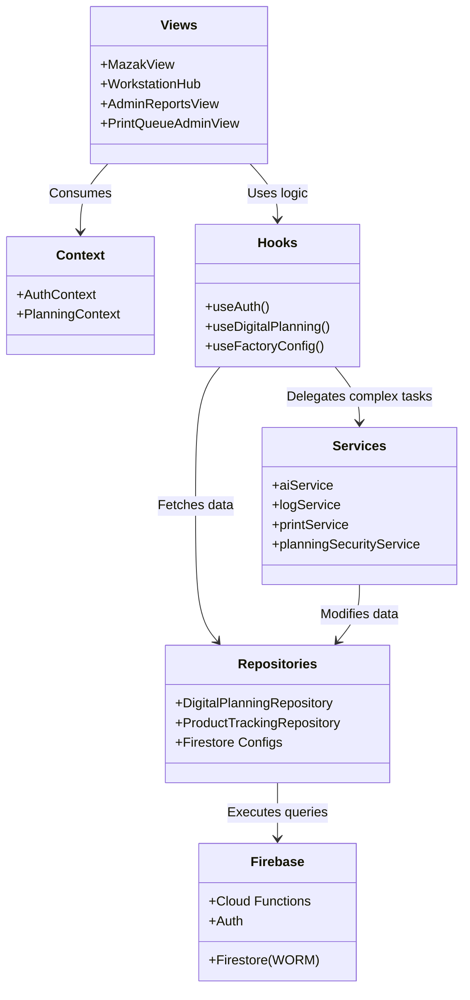

# Module Architectuur

Dit diagram toont de logische lagen van de React applicatie, van de views tot aan de databronnen.

## Lagen Structuur

1. **Views (UI)**: De pure presentatielaag, gebouwd met React en Tailwind CSS.
2. **Context & Hooks**: Beheert globale state en encapsuleert domein-logica. Voorkomt prop-drilling en verbergt Firebase details voor de UI.
3. **Services**: Bevat de zware bedrijfslogica (bijv. Audit Logging, Automation Engine evaluaties). Communiceert vaak direct met Cloud Functions voor bevoorrechte acties.
4. **Repositories**: Verantwoordelijk voor data-toegang. Alle Firestore query-logica hoort hier te zitten.
5. **Firebase**: De daadwerkelijke cloud backend.
