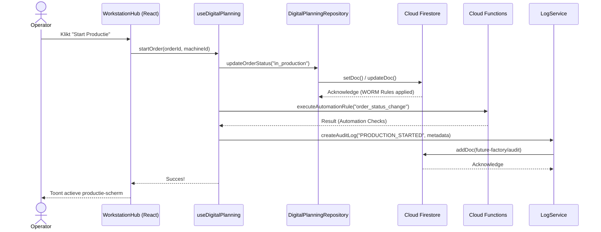

# Workflow: Order Starten (Operator)

Dit sequence diagram toont de stroom van operaties wanneer een operator een productie-order start in het systeem. Dit illustreert hoe de UI, Firebase Firestore en de Audit Trail samenwerken.

## Key Concepten
- **WORM Rules**: Firestore regels staan inserts toe op de audit trail, maar verbieden updates en deletes (Write-Once, Read-Many).
- **Cloud Functions**: Zware automatiseringen of het forceren van permissies buiten de Operator rol gebeuren in backend callables (beveiligd met check of de gebruiker geauthenticeerd is).
- **Audit**: Alle kritieke handelingen schrijven een log weg naar de audit collectie via de `logService`.
